## 一.简单介绍

### 1.功能

1. 自动点赞
2. 自动收藏
3. 自动评论
4. 优先三连评论自己的大佬
5. 评论自己的大佬自动加入白名单,并设置优先等级
6. 每天定时进行三连白名单好友
7. 白名单每人每天的三连状态管理
8. 每日三连数量管理
9. 根据用户权重进行优先三连
10. 添加评论小黑屋规避,每天最多评论 48 篇
11. 自动回复评论自己最近 5 篇博客
12. 文章管理
13. 单篇文章三连
14. 单篇文章Checkbox三连
15. 添加质量分查询
16. 新增文章增加文章质量分
17. 新增每日状态管理,每日超限判断更加合理
18. 新增自动刷浏览量功能
19. 新增私信管理

### 2.更新日志

#### v0.0.2-20231111

- 新增README文档启动说明,方便快速入手;
- 新增前端其他模块的接口,避免启动前端报错,也方便自己同步代码;
- 新增前端私信管理,页面化一键管理私信;
- 新增其他用户给自己点赞收藏的管理
  - 如果是粉丝,则三连并发送已完成三连私信
  - 如果不是粉丝,只三连
  - 并且是粉丝的优先级高于不是粉丝的处理优先级

- 三连优先级更新
  - 第一优先级为评论自己最近5篇博客的用户
  - 第二优先级为给自己点赞和收藏的用户,如果是粉丝则私信,不是粉丝不私信
  - 第三优先级为私信用户


#### v0.0.1-20231110

- 新增私信管理,自动三连私信好友的最新blog;
- 新增私信回复;
- 新增私信已读;
- 新增定时任务三连优先级;
    - 第一优先级为评论自己的好友;
    - 第二优先级为私信好友;
    - 第三优先级为白名单(按白名单好友权重设置优先级);
- 完善使用手册README,快速入手;
- 优化私信管理,不要重复回复,修改回复样式;
- 私信的三连文章是最近发布的一篇,不是置顶的一篇;

### 3.代码地址

[Gitcode 地址](https://gitcode.net/qyj19920704/csdn-automatic-triplet)

[kwan 的解忧杂货铺](http://qinyingjie.top/)

[CSDN 个人主页](https://qinyingjie.blog.csdn.net/?type=blog)

[CSDN三连管理前端Git地址](https://gitcode.net/qyj19920704/vue-springboot-kwan)

### 4.CSDN 自身限制

`博客点赞规则:`
由用户一天限点赞 10 次，更新为根据博客等级和权益来设置：

- 1-3 级 15 次/天
- 4-6 级 30 次/天
- 6 及以上 50 次/天
- 博客专家/vip 用户 100 次/天

`其他规则:`

- 单用户每天（自然日）最多发表 55 条评论；
- 单用户 2 个自然日内（时间窗口）评论量超过 100 条，将被禁言 48 小时；
- 单用户，每分钟评论最多 3 条；
- 博主自己评论自己不计入在内。
- 24小时内最多和5个人陌生人发送消息

### 5.前端地址

结合前端使用,效果更佳

[CSDN三连管理前端Git地址](https://gitcode.net/qyj19920704/vue-springboot-kwan)

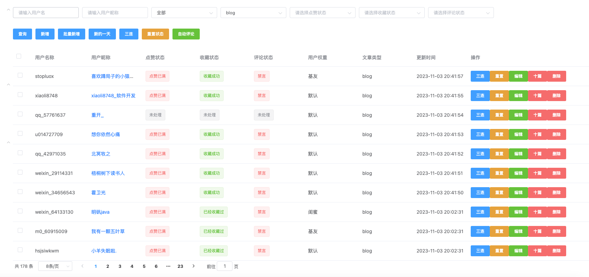

## 二.使用简介

### 1.修改自己的用户 id

self_user_name 替换为自己的 id

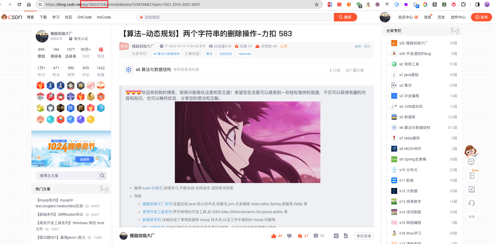

### 2.替换收藏夹

self_folder_id 替换为自己的收藏夹 id,主要是为了在自动收藏的时候,让系统知道收藏到哪个收藏夹

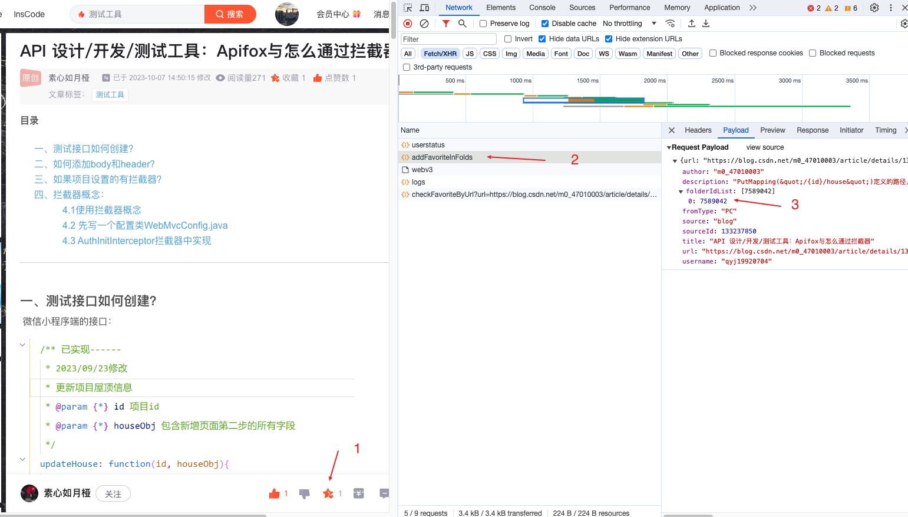

### 3.替换自己的评论

self_comment 替换自己的评论

- 不需要双引号
- 使用分号分割

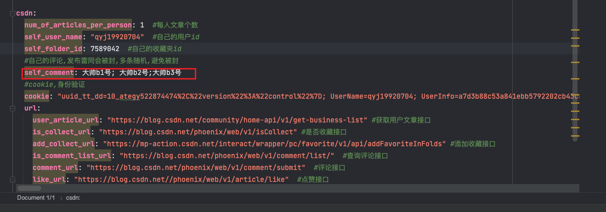

### 4.替换自己的回复

self_reply替换自己的回复,这里是给自己博客评论好友的回复

- 不需要双引号
- 使用分号分割

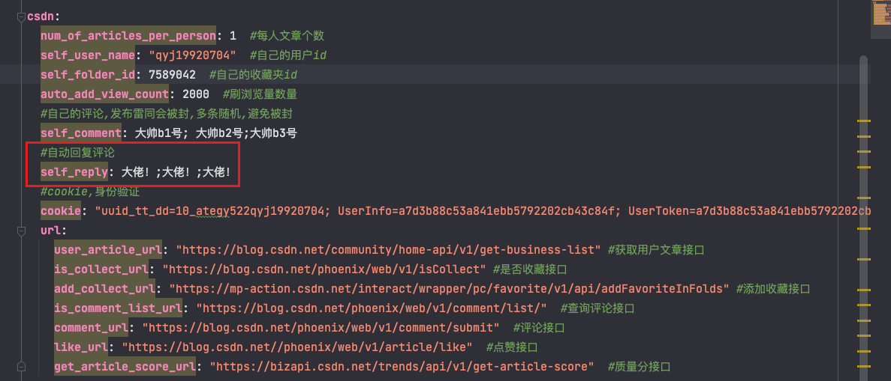

### 5.自刷浏览量设置

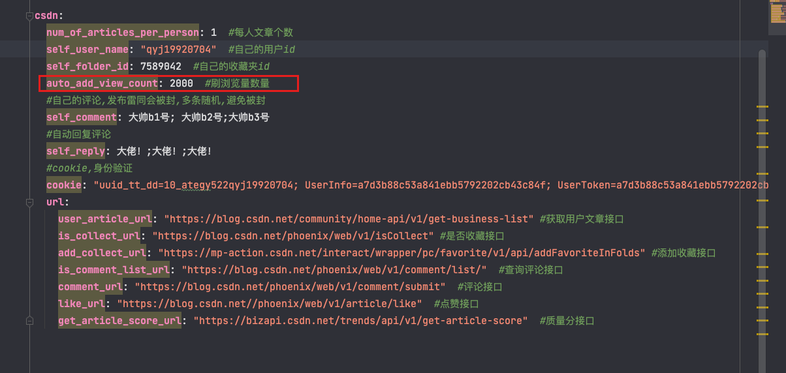

### 6.替换 cookie

cookie 替换为自己的 cookie 信息,登录 csdn 后,随便访问一个 csdn 地址,可以在 header 中看到 cookie 信息

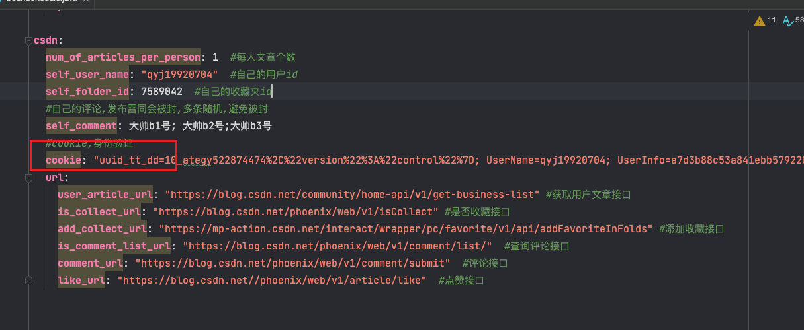
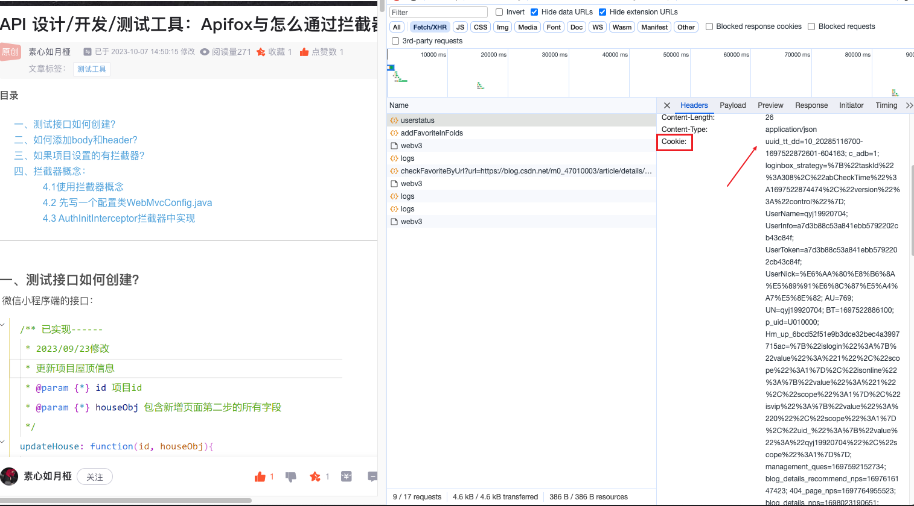

### 7.API使用

- 将API文件导入到apifox工具中,可以直接调用接口
- 结合vue前端,实时查看和操作三连

```apl
docs/apifox.json
```

### 8.控制层介绍

- CsdnArticleInfoController.java 文章Blog相关
- CsdnController.java 三连相关
- CsdnMessageController.java 私信相关
- CsdnTripletDayInfoController.java 每日三连数量监控相关
- CsdnUserController.java csdn用户相关

## 三.数据库配置

### 1.配置数据库配置

在 application-local.yml 中修改数据库配置

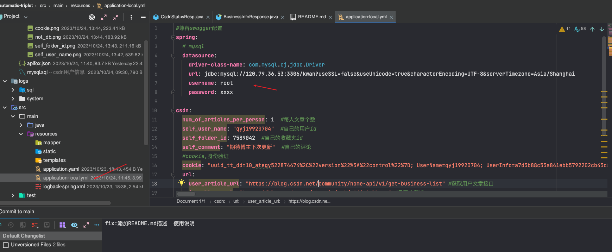

### 2.关于数据库字段更新

目前字段更新和字段添加没有使用alter table的方式,已经用过的小伙伴升级会比较头痛,后续会使用修改表的方式提供sql脚本出来,方便大家更轻松的升级,但想要真正玩好,还是得理解下简单的代码逻辑,然后搞出更多的玩法!

因为比较小众,就没有遵循版本升级规范,抱歉了各位使用了的小伙伴.后续会规范一些!

```apl
alter table kwan.table add column `xxxx_name` varchar(100) default null COMMENT 'xxx名' after `xxx_name`;
```

## 四.启动介绍

### 1.本地启动

- 安装jdk环境,对于不是java开发的同学,需要自己研究下java的环境配置
- 定位到 AppApplication.java 文件
- 运行文件

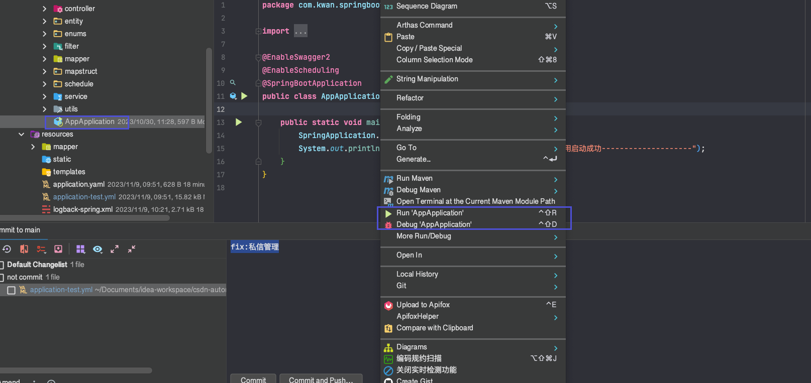

### 2.jar包运行

- 先打jar包
- 再运行jar包
- java -jar csdn-automatic-triplet-0.0.1-SNAPSHOT.jar

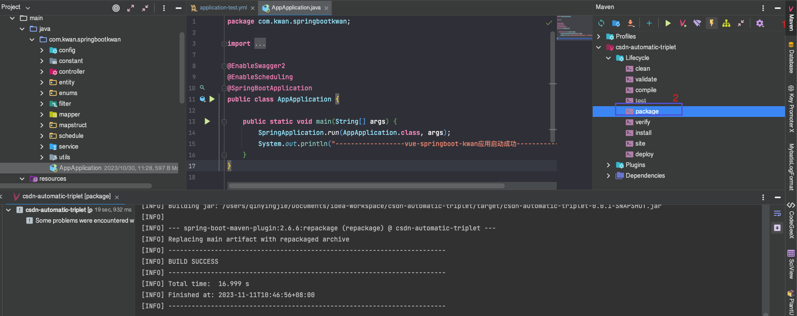

### 3.docker部署

- 使用docker打镜像
- 然后运行容器,进行部署
- mvn clean package -P test
- docker build -t csdn-automatic-triplet :$VERSION .

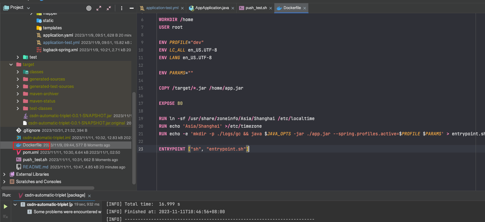
